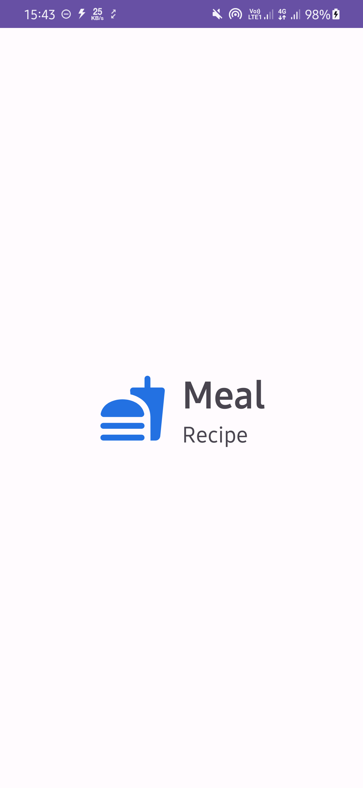
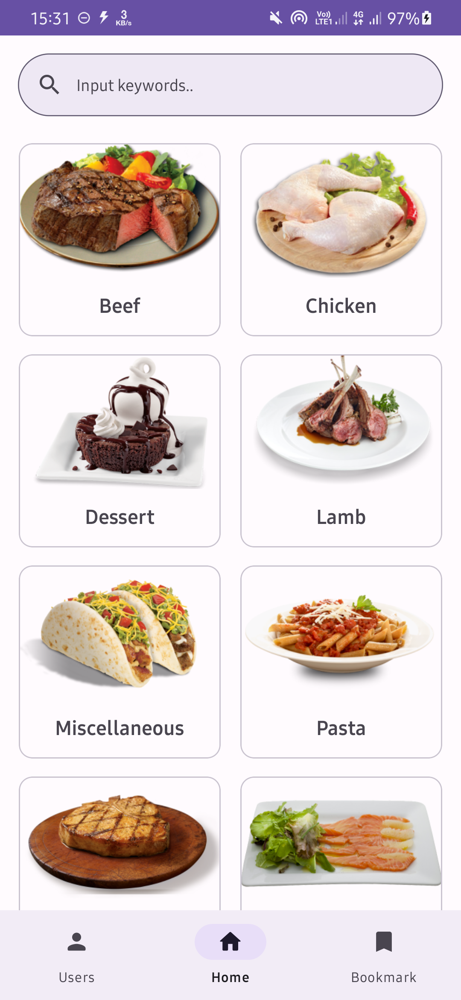
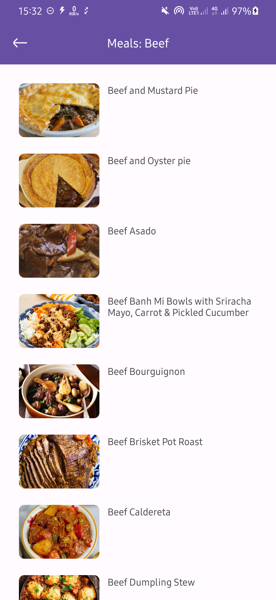
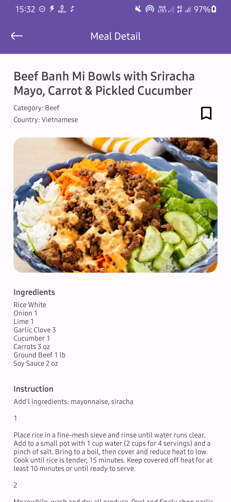
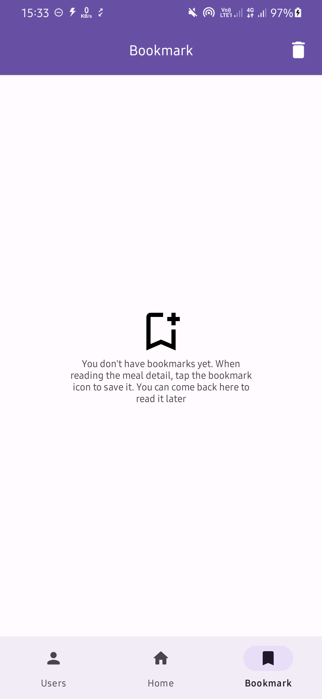
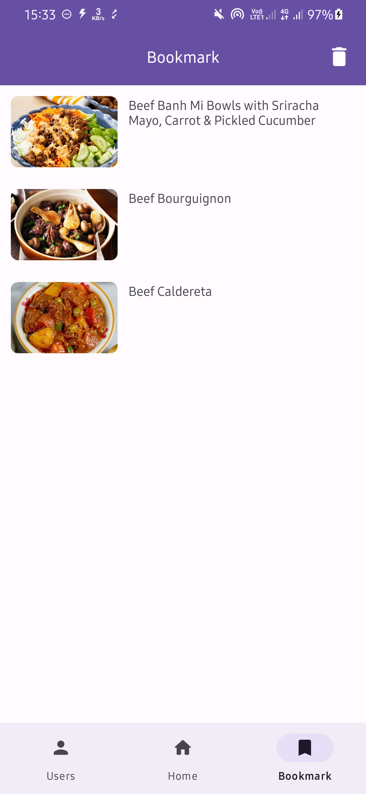

# Meal Recipe App
a simple app to view a list of food recipes from different categories

## Tech Stack & Libraries
Tech stack and libraries used
- MVVM (Model View ViewModel)
- API Client [Retrofit](https://square.github.io/retrofit/)
- Local Storage [Room](https://developer.android.com/jetpack/androidx/releases/room)
- Navigation Component
- Dependency Injection [Koin](https://insert-koin.io/)
- Logging Interceptor [Chucker Interceptor](https://github.com/ChuckerTeam/chucker)
- Pagination [Paging3](https://developer.android.com/topic/libraries/architecture/paging/v3-overview)

## Public API
This project uses the public API
- [TheMealDB](https://www.themealdb.com/api.php)
- [Reqres.In](https://reqres.in/)

## Screenshots

   
  
